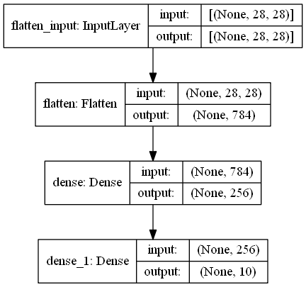

# MNIST Digit Classifier


The MNIST database is a large database of handwritten digits that is commonly used for training various image processing systems. The database is also widely used for training and testing in the field of machine learning.

This MNIST Digit Classifier takes an image as an input and predicts the digit in that image. The model has been trained using ```TensorFlow``` and ```Keras```. Note that this model is *NOT* a Convolutional Neural Network. It has been implemented by flattening out the pixels and feeding them directly to the neural network.

The model has been deployed into production using ```flask```. In order to make it available to the web, you can also consider using ```ngrok``` in order to create a tunnel to your flask application.

The model has a ```99.35%``` training accuracy and ```97.75%``` validation accuracy.

## Model Summary

The model architecture can be given as follows:



Optimizer : ```Stochastic Gradient Descent```\
Loss function : ```Sparse Categorical Cross Entropy```\
Learning Rate: ```0.01```

## Usage

1. Install all the necessary packages required for this, I suggest using conda because it makes it extremely easy to setup an environment and get started:

* tensorflow/tensorflow-gpu
* flask
* opencv-python


2. Clone or download the repository and extract it into a folder. ```cd``` into the directory and set the flask environment variable to then application name: (for Windows, check for other OS)

    ```set FLASK_APP=app.py ```

3. After the environment variable has been set, you can run the application using the following command:

    ``` flask run ```

4. Open the localhost address (127.0.0.1:5000) and use the application to upload and predict digits.


## Output

